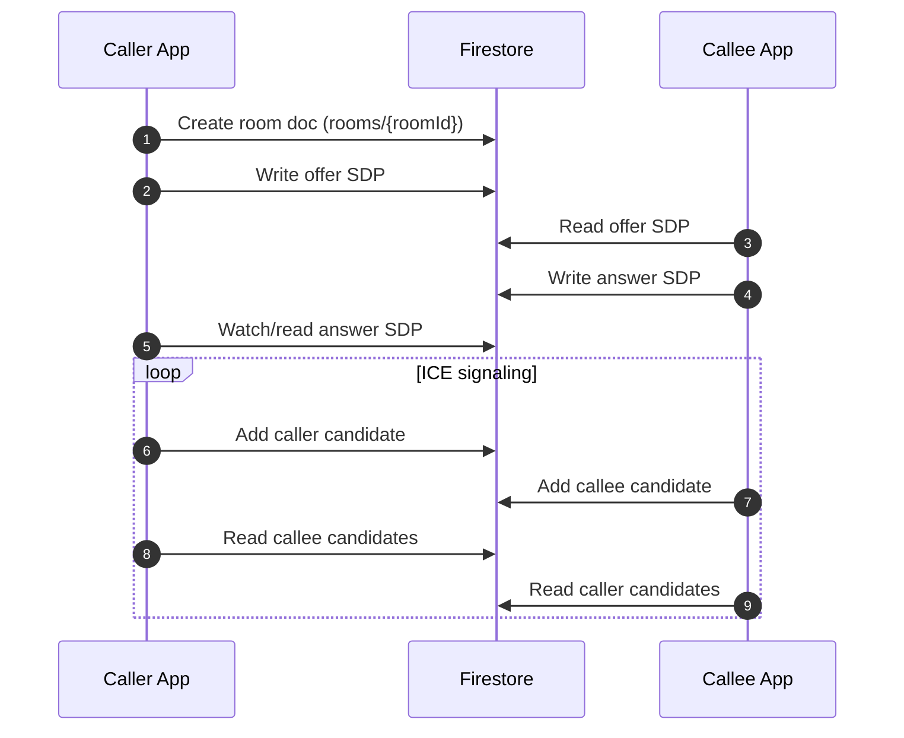
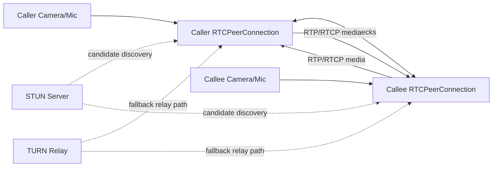
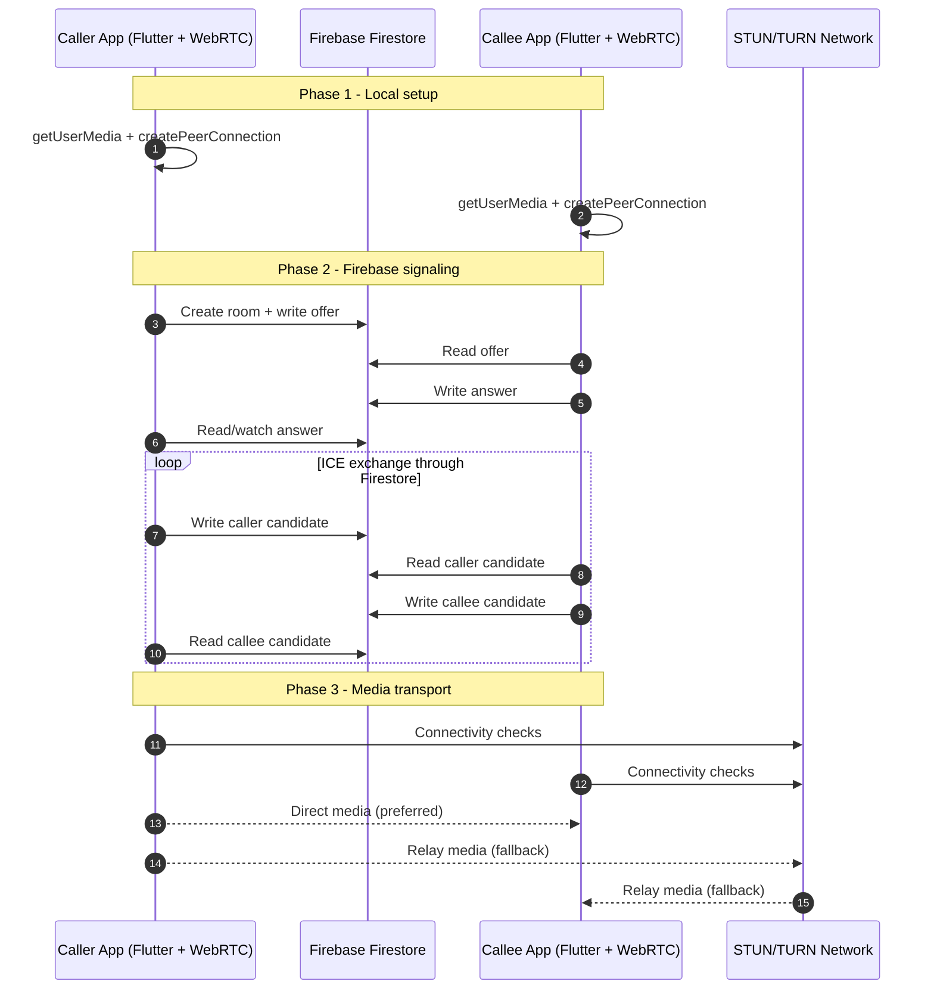

# Flutter WebRTC + Firebase 1:1 Video Call

Production-style Flutter sample for one-to-one video calling with:

- `flutter_webrtc` for peer connection and media streaming
- `cloud_firestore` for signaling (room offer/answer and ICE exchange)
- `firebase_core` + FlutterFire-generated `firebase_options.dart`

## Demo

- Video demo: [Web_RTC_Implementation_demo.mp4](https://drive.google.com/file/d/1r3w9SKGT_KGiqlTJ2IyW_sjNDOVWY2Jg/view?usp=sharing)

<p align="center">
  
</p>

---

## 1) High-Level Architecture

This app uses a split responsibility model:

- **Firebase Firestore**: signaling only (setup messages)
- **WebRTC**: real audio/video transport
- **Flutter UI**: call controls and rendering

Important: Firebase does not carry the actual video/audio stream. It only helps both peers negotiate the WebRTC connection.

---

## 2) Complete Project Structure

```text
lib/
  main.dart
  app.dart
  firebase_options.dart
  core/
    firebase/
      firebase_initializer.dart
  features/
    call/
      data/
        signaling_repository.dart
      domain/
        models/
          call_role.dart
          ice_candidate_model.dart
          session_description_model.dart
      presentation/
        controllers/
          call_controller.dart
          call_controller_state.dart
          media_track_helper.dart
          rtc_call_config.dart
        pages/
          home_page.dart
        widgets/
          video_view.dart
```

---

## 3) Setup and Run

### Firebase setup

1. Install FlutterFire CLI:
   - `dart pub global activate flutterfire_cli`
2. Configure this app to your Firebase project:
   - `flutterfire configure --project=<YOUR_EXISTING_PROJECT_ID>`
3. Generated file:
   - `lib/firebase_options.dart`

### Run app

1. `flutter pub get`
2. `flutter run`

### Optional TURN override at runtime

The app includes default TURN fallback, but you can override:

```bash
flutter run \
  --dart-define=TURN_URL=turn:your-turn-host:3478 \
  --dart-define=TURN_USERNAME=your_user \
  --dart-define=TURN_CREDENTIAL=your_password
```

---

## 4) Firestore Data Model

Collection:

- `rooms`

Room document:

- `rooms/{roomId}`
  - `offer`
  - `answer`
  - `createdAt`

Subcollections:

- `rooms/{roomId}/callerCandidates`
- `rooms/{roomId}/calleeCandidates`

### STUN, ICE, and SDP Explained

- **SDP (Session Description Protocol)**
  - A text description of media capabilities and call setup details.
  - Contains what each side can send/receive (audio/video codecs, media directions).
  - In this project:
    - caller writes `offer` SDP
    - callee writes `answer` SDP

- **ICE (Interactive Connectivity Establishment)**
  - The mechanism WebRTC uses to find a working network path between peers.
  - Each peer gathers multiple connection candidates and tries them until one works.
  - In this project:
    - caller candidates are written to `callerCandidates`
    - callee candidates are written to `calleeCandidates`
    - each peer listens to the opposite collection and adds remote candidates

- **STUN (Session Traversal Utilities for NAT)**
  - Helps a peer discover its public-facing address behind NAT/router.
  - Usually enables direct peer-to-peer when network conditions permit.
  - In this project, STUN servers are part of the ICE server list.

- **TURN (Traversal Using Relays around NAT)**
  - Relay server used when direct peer-to-peer fails.
  - More reliable across strict NAT/firewalls, but adds relay cost/latency.
  - In this project, TURN is configured in `rtc_call_config.dart`.

### How SDP + ICE + STUN/TURN Work Together

1. Caller and callee first exchange **SDP** (`offer` / `answer`) through Firestore.
2. Both peers gather **ICE candidates** (host, STUN-reflexive, and possibly TURN relay).
3. Candidates are exchanged through Firestore subcollections.
4. WebRTC ICE checks test candidate pairs.
5. If direct route works, media is peer-to-peer; otherwise it falls back to TURN relay.
6. Once ICE reaches connected/completed state, continuous audio/video streaming begins.

---

## 5) Flow 1: Firebase-Only Signaling Flow

This section describes only what Firebase does.

1. Caller creates room document in `rooms`.
2. Caller writes `offer` SDP into that room.
3. Callee reads `offer` from room document.
4. Callee writes `answer` SDP back to same room document.
5. Caller watches room and reads `answer`.
6. Caller and callee continuously write ICE candidates:
   - caller -> `callerCandidates`
   - callee -> `calleeCandidates`
7. Each side listens to the other side's candidate subcollection.



---

## 6) Flow 2: WebRTC-Only Media Flow

This section describes only how media streams.

1. Each device creates an `RTCPeerConnection`.
2. Each device captures local media with `getUserMedia` (audio + video).
3. Local tracks are attached to peer connection via `addTrack`.
4. After SDP and ICE negotiation are complete, peer connection becomes `connected`.
5. Remote media arrives in `onTrack`.
6. Remote stream is rendered by `RTCVideoView`.
7. Actual audio/video packets are carried by WebRTC transport:
   - direct peer-to-peer when possible
   - TURN relay when direct path fails



---

## 7) Flow 3: Combined End-to-End Flow (Firebase + WebRTC)



---

## 8) File-by-File Explanation (What each file does)

### App bootstrap

- `lib/main.dart`
  - App entry point.
  - Ensures Flutter binding and starts app widget.

- `lib/app.dart`
  - Initializes Firebase before showing call UI.
  - Handles loading and initialization error UI.

- `lib/core/firebase/firebase_initializer.dart`
  - Calls `Firebase.initializeApp(...)` safely once.

- `lib/firebase_options.dart`
  - Generated by FlutterFire CLI.
  - Contains per-platform Firebase credentials/config.

### Domain models

- `call_role.dart`
  - Enum to distinguish caller/callee candidate paths.

- `session_description_model.dart`
  - Maps SDP `type` and `sdp` to/from Firestore map.

- `ice_candidate_model.dart`
  - Maps ICE candidate fields to/from Firestore map.

### Data/signaling

- `signaling_repository.dart`
  - Firestore abstraction layer for signaling.
  - Keeps controller independent from raw Firestore APIs.

### Controller and helpers

- `call_controller_state.dart`
  - Mutable UI/controller state container.
  - Central reset method for call state values.

- `rtc_call_config.dart`
  - STUN/TURN configuration and media constraints.
  - Supports runtime TURN override via dart-define.

- `media_track_helper.dart`
  - Applies mic/camera state to local media tracks.

- `call_controller.dart`
  - Main orchestration:
    - create/join/hangup flow
    - peer connection lifecycle
    - candidate subscriptions
    - renderer state updates
    - mic/camera toggles

### UI

- `home_page.dart`
  - Main call screen.
  - Buttons: create/join/hangup/mic/camera/copy room id.
  - Displays room and connection state.

- `video_view.dart`
  - Reusable local/remote renderer widget with label overlay.

---

## 9) Method-by-Method Implementation Summary

### `SignalingRepository`

- `createRoom(offer)`
  - Creates room doc and initial offer payload.
- `updateOffer(roomId, offer)`
  - Updates room with finalized caller offer.
- `setAnswer(roomId, answer)`
  - Writes callee answer to room.
- `getOffer(roomId)`
  - Fetches offer once.
- `watchAnswer(roomId)`
  - Streams room snapshots and maps answer updates.
- `addIceCandidate(roomId, role, candidate)`
  - Writes candidate to caller/callee subcollection.
- `watchRemoteCandidates(roomId, role)`
  - Streams opposite candidate collection and maps to `RTCIceCandidate`.
- `deleteRoom(roomId)`
  - Deletes room and both candidate subcollections.

### `CallController`

- `createRoom()`
  - Caller flow: reset -> prepare -> create room -> create offer -> write offer -> watch answer.
- `joinRoom(roomId)`
  - Callee flow: reset -> prepare -> wait/get offer -> set remote -> create/write answer.
- `_waitForValidOffer(roomId)`
  - Prevents race condition by retrying until non-empty SDP exists.
- `hangUp()`
  - Ends local session and cleans Firestore room.
- `toggleMic()`
  - Inverts mic state and applies to audio tracks.
- `toggleCamera()`
  - Inverts camera state and applies to video tracks.
- `_prepareConnection(role)`
  - Creates peer connection, gets media stream, adds tracks, registers callbacks.
- `_startRemoteCandidatesSubscription(role)`
  - Subscribes to remote candidate stream and adds/queues candidates.
- `_flushPendingCandidates()`
  - Adds queued candidates once remote description is set.
- `_resetSession()`
  - Stops tracks, disposes resources, clears subscriptions/state.
- `_applyMediaTrackStates()`
  - Applies mic/camera flags to local stream tracks.
- `_runGuarded(action)`
  - Standard loading/error wrapper for async controller actions.

---

## 10) Development Firestore Rules (Testing Only)

Use permissive rules during development only:

```text
rules_version = '2';
service cloud.firestore {
  match /databases/{database}/documents {
    match /rooms/{roomId} {
      allow read, write: if true;
      match /{document=**} {
        allow read, write: if true;
      }
    }
  }
}
```

Before production, restrict access with Firebase Authentication and per-room authorization.

---

## 11) Operational Notes

- Use **Create Room** on one device only.
- Use **Join Room** on second device with same room id.
- Prefer testing on real devices for stable camera/network behavior.
- If connection stalls at `checking/failed`, TURN routing is the first thing to verify.
